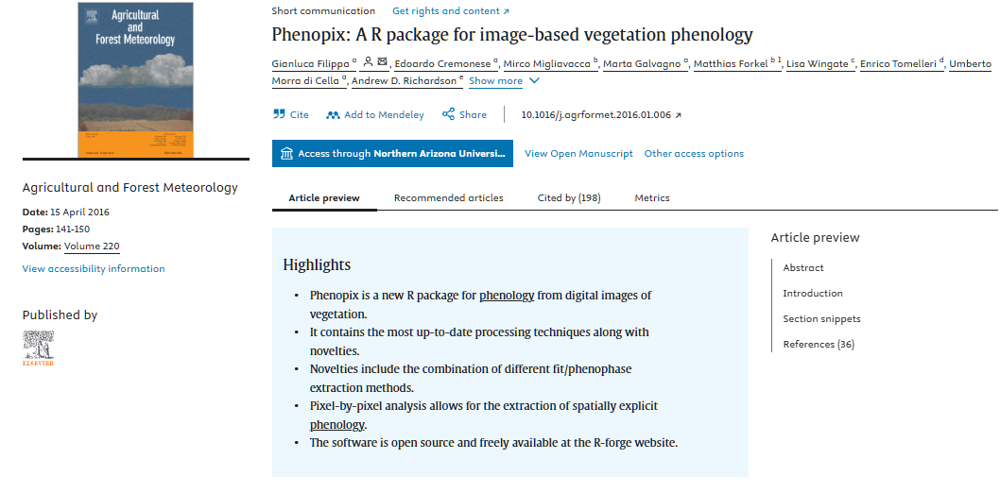
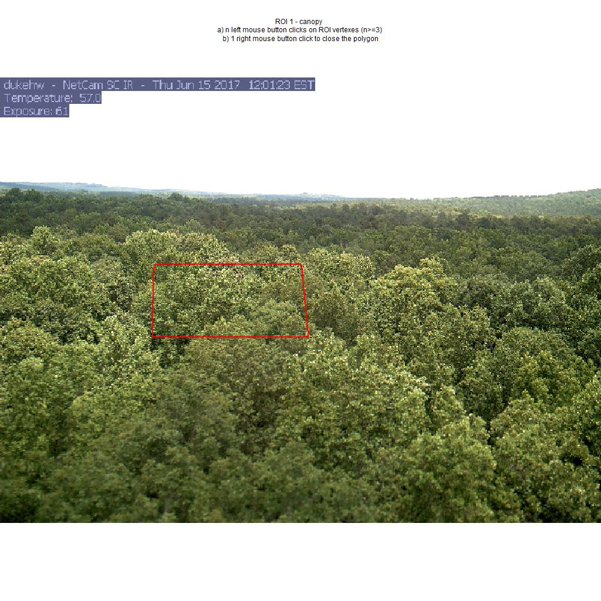
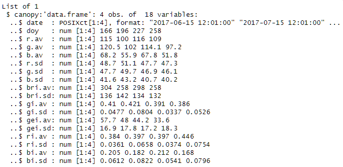
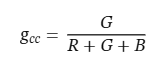
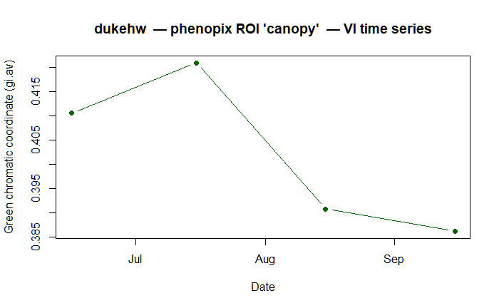
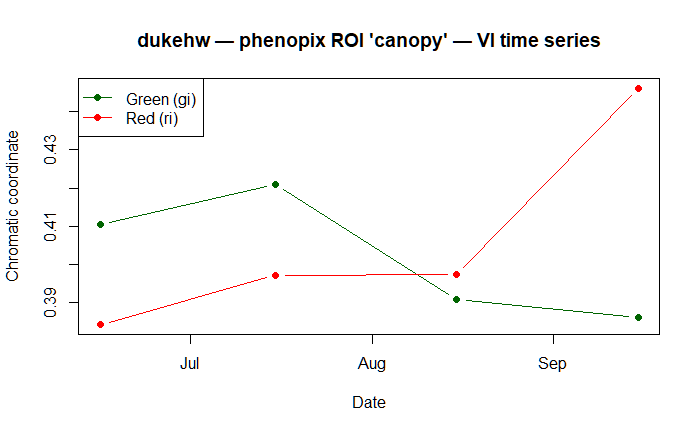

# PhenoCam: Digital Repeat Photography Networks & Methods

> Estimated Time: 4 hours


**Course participants**: As you review this information, please
consider the final course project
that you will work on at the over this semester. At the end of this section, you will
document an initial research question or idea and associated data needed to
address that question, that you may want to explore while pursuing this course.


## Learning Objectives

At the end of this activity, you will be able to:

  1. Understand how phenology is a large driver of biosphere-atmosphere interactions, and is a sensitive indicator of climate change.
  
  2. Summarize data which can be pulled out of digital repeat imagery
  
  3. Describe basic processing of digital repeat photography
  
  3. Perform basic image processing.

  4. Estimate image haziness as an indication of fog, cloud or other natural or artificial factors using the `hazer`R package.

  5. Define and use a Region of Interest, or ROI, for digitial repeat photography methods.

  6. Handle Field-of-View (FOV) shifts in digital repeat photography.

  7. Extract timeseries data from a stack of images using color-based metrics.
  
### Guest Lectures

#### PhenoCam, marrying phenology and fluxes

<iframe width="560" height="315" src="https://www.youtube.com/embed/_4uHLXL1yZA" frameborder="0" allow="accelerometer; autoplay; encrypted-media; gyroscope; picture-in-picture" allowfullscreen></iframe>

*This is not the correct video, it is a placeholder*

>(1 hour, 12 minutes)

**Andrew Richardson**, Regents Professor at Northern Arizona University's Center of Ecosystem Science and Society ([Ecoss](https://ecoss.nau.edu/)) and School of Informatics, Computing and Cyber Systems ([SICCS](https://ecoinfo.nau.edu/)), and Principal Investigator of PhenoCam explains the background of PhenoCam, its conception, and its spacial design.


#### Digital repeat photography methods

<iframe width="560" height="315" src="https://www.youtube.com/embed/WOfdshm94KM" title="YouTube video player" frameborder="0" allow="accelerometer; autoplay; clipboard-write; encrypted-media; gyroscope; picture-in-picture; web-share" allowfullscreen></iframe>

>(1 hour, 12 minutes)

**Bijan Seyednasrollah**, Post-doctoral scholar at Northern Arizona University, School of Informatics, Computing, and Cyber Systems, and lead developer of phenocamapi, covers digital repeat photography methods and the phenocamapi R package.


### Assignments in this chapter

  - [*Digital Repeat Photography Written Questions*](#digital-repeat-photography-written-questions) Demonstrate your knowledge of PhenoCam's philosophy and practices, and identify how these intersect with your own research interests (4.4).
  
  - [*Digital Repeat Photography Coding Lab*](#digital-repeat-photography-coding-lab) Download and Manipulate digital repeat photography data using the R packages covered in this chapter (4.13.1).
  
  - [*PhenoCam Culmination Activity*](#phenocam-culmination-activity) Summarize a project you might explore using PhenoCam (4.13.2). 
  
## The PhenoCam Network Mission & Design

<iframe width="560" height="315" src="https://www.youtube.com/embed/_4uHLXL1yZA" frameborder="0" allow="accelerometer; autoplay; encrypted-media; gyroscope; picture-in-picture" allowfullscreen></iframe>

**Since its inception, the objective of the PhenoCam network has been to serve as a repository for phenologically-relevant, digital, repeat (time-lapse) imagery, and to make that imagery, and derived data products, freely available to a wide array of third-party data end-users, including researchers, educators, and the general public.**


"Thus, imagery from the PhenoCam archive is made publicly available, without restriction, and we encourage you to download imagery and datasets for use in your own research and teaching. In return, we ask that you acknowledge the source of the data and imagery, and abide by the terms of the Creative Commons CC BY Attribution License." 


### Relevant documents & background information:

* [The PhenoCam Gallery](https://phenocam.sr.unh.edu/webcam/gallery/)

* [A map of PhenoCam locations](https://phenocam.sr.unh.edu/webcam/network/map/)

* [A site table of all PhenoCams](https://phenocam.sr.unh.edu/webcam/network/table/)

* [PhenoCam metadata](https://phenocam.sr.unh.edu/webcam/tools/site_metadata_format/)

## PhenoCam’s Spatial design:

The PhenoCam Network is:

* A voluntary 'opt in' network with collaborators who are varied, including: 

  + Individual research labs or field sites in North America, Europe, Asia, Africa, South America

  + Individuals who think it would be cool to be part of a network like this
  


The project is largely run by the Richardson Lab at NAU, with support from key collaborators at the University of New Hampshire who provide server and website management.

Anyone can buy a relatively inexpensive camera, run some simple scripts to correct for things like auto-white balance (which we will cover later), and patch in to the netowrk.  PhenoCam then retrieves, archieves and processess imagery for distribution.


### PhenoCam as a Near Surface Remote Sensing Technique

<iframe width="560" height="315" src="https://www.youtube.com/embed/l3d3shbF2_s" frameborder="0" allow="accelerometer; autoplay; encrypted-media; gyroscope; picture-in-picture" allowfullscreen></iframe>

> 6 years of PhenoCam imagery at Harvard Forest


* PhenoCam uses imagery from networked digital cameras for continuous monitoring of plant canopies

* Images are recorded approximately every 30 minutes (every 15 minutes for NEON), sunrise to sunset, 365 days a year

* The scale of observations is comparable to that of tower-based land-atmosphere flux measurements

* PhenoCams provide a direct link between what is happening on the ground and what is seen by satellites
PhenoCams cover a wide array of:

* Plant Funtional Types (PFTs)

```{r, echo=FALSE}
knitr::include_graphics('./images/phenocams.png')
```

* Ecoregions

```{r, echo=FALSE}
knitr::include_graphics('./images/phenocam_zones.png')
```

> Spatial distribution of PhenoCam data across ecological regions of North America. Background map
illustrates USA Environmental Protection Agency Level I Ecoregions. Data counts have been aggregated to
a spatial resolution of 4°, and the size of each circle corresponds to the number of site-years of data in the 4×4°
grid cell. Sites in Hawaii, Puerto Rico, Central and South America, Europe, Asia and Africa (total of 88 site
years) are not shown. (Seyednasrollah et al., 2019)

* Co-Located Networks
 
 + [Flux towers](https://phenocam.sr.unh.edu/webcam/network/search/?sitename=spruce&type=I&primary_vegtype=&dominant_species=&active=unknown&fluxdata=unknown&group=)
 
 + [NEON](https://phenocam.sr.unh.edu/webcam/network/search/?sitename=&type=I&primary_vegtype=&dominant_species=&active=unknown&fluxdata=false&group=NEON)
 
 + [LTER/LTAR](https://phenocam.sr.unh.edu/webcam/network/search/?sitename=&type=I&primary_vegtype=&dominant_species=&active=unknown&fluxdata=false&group=LTAR)

* Ambient vs. Experimental set ups

```{r, echo=FALSE}
knitr::include_graphics('./images/spruce_phenocam.png')
```


  - [SEGA sites](https://phenocam.sr.unh.edu/webcam/network/search/?sitename=sega&type=I&primary_vegtype=&dominant_species=&active=unknown&fluxdata=unknown&group=)

  - [SPRUCE Experiment](https://phenocam.sr.unh.edu/webcam/network/search/?sitename=spruce&type=I&primary_vegtype=&dominant_species=&active=unknown&fluxdata=unknown&group=)

### How PhenoCams Pull Data

```{r, echo=FALSE}
knitr::include_graphics('./images/Screen Shot 2020-09-13 at 5.46.32 PM.png')
```

### Leveraging camera near-infrared (NIR) capabilities

[Petach et al., Agricultural & Forest Meteorology 2014](http://harvardforest.fas.harvard.edu/publications/pdfs/Petach_AgriForestMeteor_2014.pdf)

CMOS sensor is sensitive to \lambda > 700 nm

```{r, echo=FALSE}
knitr::include_graphics('./images/phenocamNIR.png')
```

A software-controlled filter enables sequential VIS (RGB color) and VIS+NIR (monochrome) images
Potential applications:

* false color images

* “camera NDVI” as alternative to GCC

```{r, caption='Winter vs. Summer NIR', echo=FALSE,}

knitr::include_graphics(c("./images/phenocamFALSE1.png","./images/phenocamFALSE2.png"))
``` 


## PhenoCam Exercises Part 1

### Digital Repeat Photography Written Questions


*Suggested completion: Before Digital Repeat Photography methods (day 2 PhenoCam)*

**Question 1:** What do you see as the value of the images themselves?  The 1 or 3-day products, the transition dates?  How could they be used for different applications?

**Question 2:** Why does PhenoCam take photos every 15-30 minutes, but summarize to 1 or 3-day products?

**Question 3:** Why does canopy color coordinate with photosynthesis in many ecosystems?  Name an example of a situation where it wouldn't and explain why.

**Question 4:** Why are there sometimes multiple **Regions of Interest (ROIs)** for a PhenoCam?

**Question 5:** How might or does the PhenoCam project
intersect with your current research or future career goals? *(1 paragraph)*

**Question 6:**
Use the map on the [PhenoCam website](https://phenocam.sr.unh.edu/webcam/network/map/) to answer the following questions. Consider the research question that you may explore as your final semester project or a current project that you are working on and answer each of the following questions:

* Are there PhenoCams that are in study regions of interest to you?  
* Which PhenoCam sites does your current research or final project ideas
coincide with?  
* Are they connected to other networks (e.g. LTAR, NEON, Fluxnet)?  
* What is the data record length for the sites you're interested in?

**Question 7:**
Consider either your current or future research, or a question you’d like to
address during this course:

* Which types of PhenoCam data may be more useful to address these questions?
* What non-PhenoCam data resources could be combined to help address your question?
* What challenges, if any, could you foresee when beginning to work with these
data?


## Introduction to Digital Repeat Photography Methods

The concept of repeat photography for studying environmental has been
introduced to scientists long time ago (See Stephens et al., 1987).
But in the past decade the idea has gained much popularity for monitoring
environmental change (e.g., Sonnentag et al., 2012).
One of the main applications of digital repeat photography is studying vegetation
phenology for a diverse range of ecosystems and biomes (Richardson et al., 2019).
The methods has also shown great applicability in other fields such as:

1. assessing the seasonality of gross primary production,

2. salt marsh restoration,

3. monitoring tidal wetlands,

4. investigating growth in croplands, and

5. evaluating phenological data products derived from satellite remote sensing.

Obtaining quantitative data from digital repeat photography images is usually
performed by defining appropriate region of interest, also know as ROI's,
and for the red (R), green (G) and blue (B) color channels, calculating
pixel value (intensity) statistics across the pixels within each ROI.
ROI boundaries are delineated by mask files which define which pixels
are included and which are excluded from these calculations.

The masks are then used to extract color-based time series from a stack of images.
Following the time-series, statistical metrics are used to obtain
1-day and 3-day summary time series.
From the summary product time series, phenological transition dates
corresponding to the start and the end of green-up and green-down
phenological phases are calculated.
In this chapter we explain this process by starting from general
image processing tools and then to phenocam-based software applications.

For more details about digital repeat photogrpahy you can check out the following publications:
- <a href="https://bnasr.github.io/papers/Seyednasrollah_et_al_2019_SciData.pdf">Seyednarollah, et al. 2019, "Tracking vegetation phenology across diverse biomes using Version 2.0 of the PhenoCam Dataset "</a>.
- <a href="https://bnasr.github.io/papers/Seyednasrollah_et_al_2019_PRS.pdf">Seyednarollah, et al. 2019, "Data extraction from digital repeat photography using xROI: An interactive framework to facilitate the process"</a>.

## Pulling Data via the *phenocamapi* Package

The <https://github.com/bnasr/phenocamapi> *
* R package</a>
is developed to simplify interacting with the
<a href="https://phenocam.sr.unh.edu" target="_blank">PhenoCam network</a>
dataset and perform data wrangling steps on PhenoCam sites' data and metadata.

This tutorial will show you the basic commands for accessing PhenoCam data
through the PhenoCam API. The *phenocampapi* R package is developed and maintained by
<a href="https://bnasr.github.io/" target="_blank">Bijan Seyednarollah</a>.
The most recent release is available on GitHub (<a href="https://github.com/bnasr/phenocamapi" target="_blank">PhenocamAPI</a>).
<a href="https://github.com/bnasr/phenocamapi/tree/master/vignettes" target ="_blank">Additional vignettes</a>
can be found on how to merge external time-series (e.g. Flux data) with the
PhenoCam time-series.

We begin with several useful skills and tools for extracting PhenoCam data
directly from the server:

- Exploring the PhenoCam metadata
- Filtering the dataset by site attributes
- Extracting the list of midday images
- Downloading midday images for a given time range

## Exploring PhenoCam metadata

Each PhenoCam site has specific metadata including but not limited to how a site
is set up and where it is located, what vegetation type is visible from the
camera, and its climate regime. Each PhenoCam may have zero to several Regions
of Interest (ROIs) per vegetation type. The *phenocamapi* package is an
interface to interact with the PhenoCam server to extract those data and
process them in an R environment.

To explore the PhenoCam data, we'll use several packages for this tutorial.


```{r, quiet=TRUE}

library(data.table)
library(phenocamapi)
library(lubridate)
library(jpeg)
```


We can obtain an up-to-date `data.frame` of the metadata of the entire PhenoCam
network using the `get_phenos()` function. The returning value would be a
`data.table` in order to simplify further data exploration.


```{r, cache=TRUE}

# obtaining the phenocam site metadata from the server as data.table
phenos <- phenocamapi::get_phenos()

# checking out the first few sites
head(phenos$site)

# checking out the columns
colnames(phenos)
```

Now we have a better idea of the types of metadata that are available for the
Phenocams.

### Remove null values

We may want to explore some of the patterns in the metadata before we jump into
specific locations.

Let's look at Mean Annual Precipitation (MAP) and Mean Annual
Temperature (MAT) across the different field site and classify those by the
primary vegetation type (`primary_veg_type`) for each site. We can find out what
the abbreviations for the vegetation types mean from the following table:


|Abbreviation|Description|
|-|-|
| AG |	agriculture |
| DB |	deciduous broadleaf |
| DN |	deciduous needleleaf |
| EB |	evergreen broadleaf |
| EN |	evergreen needleleaf |
| GR |	grassland |
| MX |	mixed vegetation (generally EN/DN, DB/EN, or DB/EB) |
| SH |	shrubs |
| TN |	tundra (includes sedges, lichens, mosses, etc.) |
| WT |	wetland |
| NV |	non-vegetated |
| RF |	reference panel | 	 
| XX |	unspecified |


To do this we'd first want to remove the sites where there is not data and then
plot the data.


```{r, cache=TRUE}
# removing the sites with unkown MAT and MAP values
phenos <- phenos[!((MAT_worldclim == -9999)|(MAP_worldclim == -9999))]

# extracting the PhenoCam climate space based on the WorldClim dataset
# and plotting the sites across the climate space different vegetation type as different symbols and colors
phenos[primary_veg_type=='DB', plot(MAT_worldclim, MAP_worldclim, pch = 19, col = 'green', xlim = c(-5, 27), ylim = c(0, 4000))]

phenos[primary_veg_type=='DN', points(MAT_worldclim, MAP_worldclim, pch = 1, col = 'darkgreen')]

phenos[primary_veg_type=='EN', points(MAT_worldclim, MAP_worldclim, pch = 17, col = 'brown')]

phenos[primary_veg_type=='EB', points(MAT_worldclim, MAP_worldclim, pch = 25, col = 'orange')]

phenos[primary_veg_type=='AG', points(MAT_worldclim, MAP_worldclim, pch = 12, col = 'yellow')]

phenos[primary_veg_type=='SH', points(MAT_worldclim, MAP_worldclim, pch = 23, col = 'red')]


legend('topleft', legend = c('DB','DN', 'EN','EB','AG', 'SH'),
       pch = c(19, 1, 17, 25, 12, 23),
       col =  c('green', 'darkgreen', 'brown',  'orange',  'yellow',  'red' ))
```


### Filtering using attributes

Alternatively, we may want to only include Phenocams with certain attributes in
our datasets. For example, we may be interested only in sites with a co-located
flux tower. For this, we'd want to filter for those with a flux tower using the
`flux_sitenames` attribute in the metadata.


```{r, cache=TRUE}
# store sites with flux_data available and the FLUX site name is specified
phenofluxsites <- phenos[flux_data==TRUE&!is.na(flux_sitenames)&flux_sitenames!='',
                         .(PhenoCam=site, Flux=flux_sitenames)] # return as table
#and specify which variables to retain

phenofluxsites <- phenofluxsites[Flux!='']

# see the first few rows
head(phenofluxsites)

```

We could further identify which of those Phenocams with a flux tower and in
deciduous broadleaf forests (`primary_veg_type=='DB'`).


```{r, cache=TRUE}

#list deciduous broadleaf sites with flux tower
DB.flux <- phenos[flux_data==TRUE&primary_veg_type=='DB',
                  site]  # return just the site names as a list

# see the first few rows
head(DB.flux)
```


## Download midday images

While PhenoCam sites may have many images in a given day, many simple analyses
can use just the midday image when the sun is most directly overhead the canopy.
Therefore, extracting a list of midday images (only one image a day) can be useful.


```{r, cache=TRUE}

# obtaining midday_images for dukehw
duke_middays <- get_midday_list('dukehw')

# see the first few rows
head(duke_middays)
```

Now we have a list of all the midday images from this Phenocam. Let's download
them and plot


```{r, cache=TRUE}
# download a file
destfile <- tempfile(fileext = '.jpg')

# download only the first available file
# modify the `[1]` to download other images
download.file(duke_middays[1], destfile = destfile, mode = 'wb')

# plot the image
img <- try(readJPEG(destfile))
if(class(img)!='try-error'){
  par(mar= c(0,0,0,0))
  plot(0:1,0:1, type='n', axes= FALSE, xlab= '', ylab = '')
  rasterImage(img, 0, 0, 1, 1)
}
```


### Download midday images for a given time range

Now we can access all the midday images and download them one at a time. However,
we frequently want all the images within a specific time range of interest. We'll
learn how to do that next.


```{r, cache=TRUE}

# open a temporary directory
tmp_dir <- tempdir()

# download a subset. Example dukehw 2017
download_midday_images(site = 'dukehw', # which site
                       y = 2017, # which year(s)
                       months = 1:12, # which month(s)
                       days = 15, # which days on month(s)
                       download_dir = tmp_dir) # where on your computer

# list of downloaded files
duke_middays_path <- dir(tmp_dir, pattern = 'dukehw*', full.names = TRUE)

head(duke_middays_path)

```

We can demonstrate the seasonality of Duke forest observed from the camera. (Note
this code may take a while to run through the loop).

```{r, cache=TRUE}
n <- length(duke_middays_path)
par(mar= c(0,0,0,0), mfrow=c(4,3), oma=c(0,0,3,0))

for(i in 1:n){
  img <- readJPEG(duke_middays_path[i])
  plot(0:1,0:1, type='n', axes= FALSE, xlab= '', ylab = '')
  rasterImage(img, 0, 0, 1, 1)
  mtext(month.name[i], line = -2)
}
mtext('Seasonal variation of forest at Duke Hardwood Forest', font = 2, outer = TRUE)
```


The goal of this section was to show how to download a limited number of midday images from the PhenoCam server. However, more extensive datasets should be downloaded from the <a href="https://phenocam.sr.unh.edu/webcam/network/download/"> PhenoCam </a>.


The *phenocamapi* R package is developed and maintained by
<a href="https://bnasr.github.io/">Bijan Seyednarollah</a>.
The most recent release is available from
<a href="https://github.com/bnasr/phenocamapi" target="_blank">https://github.com/bnasr/phenocamapi</a>.

## Detecting Foggy Images using the 'hazer' R Package

#### Read & Plot an Image

We will use several packages in this tutorial. All are available from CRAN.


```{r}
# load packages
library(hazer)
library(jpeg)
library(data.table)
library(dplyr)
```


Before we start the image processing steps, let's read in and plot an image. This
image is an example image that comes with the *hazer* package.


```{r}
# read the path to the example image
jpeg_file <- system.file(package = 'hazer', 'pointreyes.jpg')

# read the image as an array
rgb_array <- jpeg::readJPEG(jpeg_file)

# plot the RGB array on the active device panel


# first set the margin in this order:(bottom, left, top, right)
par(mar=c(0,0,3,0))  
plotRGBArray(rgb_array, bty = 'n', main = 'Point Reyes National Seashore')
```


When we work with images, all data we work with is generally on the scale of each
individual pixel in the image. Therefore, for large images we will be working with
large matrices that hold the value for each pixel. Keep this in mind before opening
some of the matrices we'll be creating this tutorial as it can take a while for
them to load.

#### Histogram of RGB channels

A histogram of the colors can be useful to understanding what our image is made
up of. Using the `density()` function from the base *stats* package, we can extract
density distribution of each color channel.


```{r}
# color channels can be extracted from the matrix
red_vector <- rgb_array[,,1]
green_vector <- rgb_array[,,2]
blue_vector <- rgb_array[,,3]

# plotting
par(mar=c(5,4,4,2))
plot(density(red_vector), col = 'red', lwd = 2,
     main = 'Density function of the RGB channels', ylim = c(0,5))
lines(density(green_vector), col = 'green', lwd = 2)
lines(density(blue_vector), col = 'blue', lwd = 2)
```


In *hazer* we can also extract three basic elements of an RGB image :

1. Brightness
2. Darkness
3. Contrast

#### Brightness

The brightness matrix comes from the maximum value of the R, G, or B channel. We
can extract and show the brightness matrix using the `getBrightness()` function.


```{r}
# extracting the brightness matrix
brightness_mat <- getBrightness(rgb_array)

# unlike the RGB array which has 3 dimensions, the brightness matrix has only two
# dimensions and can be shown as a grayscale image,
# we can do this using the same plotRGBArray function
par(mar=c(0,0,3,0))
plotRGBArray(brightness_mat, bty = 'n', main = 'Brightness matrix')
```


Here the grayscale is used to show the value of each pixel's maximum brightness
of the R, G or B color channel.

To extract a single brightness value for the image, depending on our needs we can
perform some statistics or we can just use the mean of this matrix.


```{r}
# the main quantiles
quantile(brightness_mat)
```


```{r}
# create histogram
par(mar=c(5,4,4,2))
hist(brightness_mat)
```


**Question for the class:** Why are we getting so many images up in the high range of the brightness? Where
does this correlate to on the RGB image?

#### Darkness

Darkness is determined by the minimum of the R, G or B color channel. In the
Similarly, we can extract and show the darkness matrix using the `getDarkness()` function.


```{r}
# extracting the darkness matrix
darkness_mat <- getDarkness(rgb_array)

# the darkness matrix has also two dimensions and can be shown as a grayscale image
par(mar=c(0,0,3,0))
plotRGBArray(darkness_mat, bty = 'n', main = 'Darkness matrix')

# main quantiles
quantile(darkness_mat)
```


```{r}
# histogram
par(mar=c(5,4,4,2))
hist(darkness_mat)
```


#### Contrast

The contrast of an image is the difference between the darkness and brightness
of the image. The contrast matrix is calculated by difference between the
darkness and brightness matrices.

The contrast of the image can quickly be extracted using the `getContrast()` function.


```{r}
# extracting the contrast matrix
contrast_mat <- getContrast(rgb_array)

# the contrast matrix has also 2D and can be shown as a grayscale image
par(mar=c(0,0,3,0))
plotRGBArray(contrast_mat, bty = 'n', main = 'Contrast matrix')

# main quantiles
quantile(contrast_mat)
```


```{r}
# histogram
par(mar=c(5,4,4,2))
hist(contrast_mat)
```


#### Image fogginess & haziness

Haziness of an image can be estimated using the `getHazeFactor()` function. This
function is based on the method described in
<a href="https://www.omicsonline.org/open-access/detecting-foggy-images-and-estimating-the-haze-degree-factor-jcsb.1000226.pdf">Mao et al. (2014)</a>.
The technique was originally developed to for *"detecting foggy images and
estimating the haze degree factor"* for a wide range of outdoor conditions.

The function returns a vector of two numeric values:

1.  **haze** as the haze degree and
2.  **A0** as the global atmospheric light, as it is explained in the original paper.

The PhenoCam standards classify any image with the haze degree greater
than 0.4 as a significantly foggy image.


```{r}
# extracting the haze matrix
haze_degree <- getHazeFactor(rgb_array)

print(haze_degree)
```


Here we have the haze values for our image. Note that the values might be
slightly different due to rounding errors on different platforms.

#### Process sets of images

We can use `for` loops or the `lapply` functions to extract the haze values for
a stack of images.

You can download the related datasets from
<a href="http://bit.ly/2F8w2Ia">here (direct download)</a>.
Download and extract the zip file to be used as input data for the following step.


```{r}
#pointreyes_url <- 'http://bit.ly/2F8w2Ia'

# set up the input image directory
data_dir <- 'data/'
# dir.create(data_dir, showWarnings = F)

pointreyes_zip <- paste0(data_dir, 'pointreyes.zip')
pointreyes_dir <- paste0(data_dir, 'pointreyes')

# download zip file
# download.file(pointreyes_url, destfile = pointreyes_zip)
# unzip(pointreyes_zip, exdir = data_dir)

# get a list of all .jpg files in the directory
pointreyes_images <- dir(path = 'data/pointreyes',
                         pattern = '*.jpg',
                         ignore.case = TRUE,
                         full.names = TRUE)
```


Now we can use a for loop to process all of the images to get the haze and A0
values.


```{r}
# number of images
n <- length(pointreyes_images)

# create an empty matrix to fill with haze and A0 values
haze_mat <- data.frame()

# the process takes a bit, a progress bar lets us know it is working.
pb <- txtProgressBar(0, n, style = 3)
```


```{r}
for(i in 1:n) {
  image_path <- pointreyes_images[i]
  img <- jpeg::readJPEG(image_path)
  hz <- getHazeFactor(img)

  haze_mat <- rbind(haze_mat,
                    data.frame(file = as.character(image_path),
                               haze = hz[1],
                               A0 = hz[2]))

  setTxtProgressBar(pb, i)
}
```


Now we have a matrix with haze and A0 values for all our images. Let's
compare top three images with low and high haze values.


```{r}
top10_high_haze <- haze_mat %>%
  dplyr::arrange(desc(haze)) %>%
  slice(1:3)
top10_low_haze <-  haze_mat %>%
  arrange(haze)%>%
  slice(1:3)


par(mar= c(0,0,0,0), mfrow=c(3,2), oma=c(0,0,3,0))

for(i in 1:3){
  img <- readJPEG(as.character(top10_low_haze$file[i]))
  plot.new()
  rasterImage(img, par()$usr[1], par()$usr[3], par()$usr[2], par()$usr[4])

  img <- readJPEG(as.character(top10_high_haze$file[i]))
  plot.new()
  rasterImage(img, par()$usr[1], par()$usr[3], par()$usr[2], par()$usr[4])

}
mtext('Top images with low (left) and high (right) haze values at Point Reyes', font = 2, outer = TRUE)
```


Let's classify those into hazy and non-hazy as per the PhenoCam standard of 0.4.


```{r}
# classify image as hazy: T/F
haze_mat=haze_mat%>%
  mutate(haze_mat, foggy=ifelse(haze>.4, TRUE, FALSE))

head(haze_mat)
```


Now we can save all the foggy images to a new folder that will retain the
foggy images but keep them separate from the non-foggy ones that we want to
analyze.


```{r}
# identify directory to move the foggy images to
foggy_dir <- paste0(pointreyes_dir, 'foggy')
clear_dir <- paste0(pointreyes_dir, 'clear')

# if a new directory, create new directory at this file path
dir.create(foggy_dir,  showWarnings = FALSE)
dir.create(clear_dir,  showWarnings = FALSE)

# copy the files to the new directories
#file.copy(haze_mat[foggy==TRUE,file], to = foggy_dir)

#file.copy(haze_mat[foggy==FALSE,file], to = clear_dir)
```

Now that we have our images separated, we can get the full list of haze
values only for those images that are not classified as "foggy".  


```{r}
# this is an alternative approach instead of a for loop

# loading all the images as a list of arrays
pointreyes_clear_images <- dir(path = clear_dir,
                               pattern = '*.jpg',
                               ignore.case = TRUE,
                               full.names = TRUE)

img_list <- lapply(pointreyes_clear_images, FUN = jpeg::readJPEG)

# getting the haze value for the list
# patience - this takes a bit of time
haze_list <- t(sapply(img_list, FUN = getHazeFactor))

# view first few entries
head(haze_list)
```


We can then use these values for further analyses and data correction.


***

The *hazer* R package is developed and maintained by
<a href="https://bnasr.github.io/">Bijan Seyednarollah</a>.
The most recent release is available from
<a href="https://github.com/bnasr/hazer" target="_blank">https://github.com/bnasr/hazer</a>.

## Extracting Region of Interest and Timeseries from Images using the phenopix R Package
  
In this section, we'll learn how to use an open-source toolkit, the
<a href="https://cran.r-project.org/web/packages/phenopix/index.html" target="_blank">phenopix R package</a>
that facilitates the process of generating a region of interest and extracting time series of color channels across repeat photography. The phenopix package provides an environment for
scientists to interactively:

a) delineate regions of interest (ROIs),
b) extract values and time series of color-based metrics such as greenness, 
c) fit curves to seasonal trajectories, and 
d) extract relavent phenological theresholds or "phenophases" from imagery.

Using the *phenopix* R package allows users access to a suite of modern data processing methods for PhenoCam imagery. For further information, reference the [phenopix publication](https://www.sciencedirect.com/science/article/abs/pii/S0168192316300089). 



### Install and use the phenopix package

To begin utilizing phenopix, first install the package. 

```{r, eval=FALSE}
install.packages('phenopix')
```

Then, load phenopix.

```{r}
library(phenopix)
```
The package utilizes an expected directory structure to store phenological imagery, region of interest, and calculated vegetation indices. The general workflow is described as follows:

```
Put all your images in /IMG/ 
Put your reference image (to draw ROI) in /REF/ 
Draw your ROI with DrawROI():
 set path_img_ref to  /REF/ 
 set path_ROIs to /ROI/ 
Then you can extractVIs(): 
 set img.path as /IMG/ 
 set roi.path as /ROI/ 
 set vi.path to /VI/ 
``` 

We will start by creating the required directory structure. 
 
```{r, warning=FALSE}
# Create directories for phenopix 
img_path = "data/phenopix/IMG" # to contain phenocam images 
ref_path = "data/phenopix/REF" # to contain a reference image 
roi_path = "data/phenopix/ROI" # to contain the ROI 
vi_path = "data/phenopix/VI" # to contain vegetation index data 

dir.create(img_path, recursive = TRUE)
dir.create(ref_path)
dir.create(roi_path)
dir.create(vi_path)
```

Next we will download some images to work with from the phenocam API and store these in the /IMG/ directory. 

```{r, warning=FALSE}
# Download a few midday images 
site_name = "dukehw"

download_midday_images(
  site = site_name,
  y = 2017,
  months = 6:9,
  days = 15,
  download_dir = img_path
)
```

We need one image to use as a reference for drawing the ROI. Here, we simply use the first downloaded image, moving it into the REF folder. 

```{r,results='hide'}
# copy first image to /REF/
file.copy(
  list.files(img_path, pattern = "\\.jpg$", full.names = TRUE)[1],
  ref_path)

# record image filename 
ref_image = list.files(ref_path)
```

We can now use DrawMULTIROI() to draw a polygon around the vegetation we want to analyze. 

```{r, eval=FALSE}
# enable a new window for graphics 
windows() 

# call DrawMULTIROI()
roi.data <- DrawMULTIROI( 
  path_img_ref = ref_path, 
  path_ROIs = roi_path, 
  nroi = 1, 
  roi.names = "canopy"
)
```

After running this code, a window will open showing the reference image. Use the mouse to draw a polygon on a desired portion of the canopy, avoiding areas such as the sky which not be included in the analysis. Once finished, right click the screen and click stop. Then enter 'y' in the R console to finish.  

The polygon will be saved in the /ROI/ directory under the name "canopy".

### Check the ROI

By inspecting the /ROI/ directory, we can see that the ROI was saved as a .Rdata object, and in addition, a .jpg image was saved of the generated ROI. Inspect the image to verify that the ROI was generated correctly.

```{r, eval=FALSE}
list.files(roi_path)
```
In addition to inspecting the .jpg, the ROI object can also be visualized over a rasterized version of the reference image. 

```{r,eval=FALSE,warning=FALSE}
# load the ROI
load(file.path(roi_path, "roi.data.Rdata")) 

# load the reference image as a raster
ref_raster <- raster::flip( 
  raster::brick(file.path(ref_path, ref_image))
) 

# plot 
raster::plotRGB(ref_raster) 
sp::plot( 
  roi.data$canopy$polygons, 
  add = TRUE, 
  border = "red", 
  lwd = 2 )
```


The red polygon shows the pixels that will be used to calculate vegetation greenness.

### Extracting vegetation index time series 

One we have a suitable ROI for the imagery, we can utilize this boundary to extract time series of a particular color channel from the data. By default, this is performed using an average of pixel values in the ROI at each time step. These data are extracted using the `extractVIs()` function.

```{r, eval=FALSE}
vi.data <- extractVIs(
  img.path = img_path,
  roi.path = roi_path,
  vi.path  = vi_path,
  roi.name = "canopy",
  date.code = "yyyy_mm_dd_HHMMSS"
)
```

```{r, eval=FALSE}
# Display the structure of returned output in vi.data
str(vi.data)
```

We can see that the `extractVIs()` function returns a dataframe with several values. These include the average and standard deviation across red, green, and blue channels at each time step, as well as for set of additional calculated indices. 

These indices are: image brightness (br), the green chromatic coordinate (gi), red chromatic coordinate (ri), blue chromatic coordinate (bi), and the green excess index (gei). 
In vegetation phenology, the green chromatic coordinate (g~cc~) is widely used as an indicator of vegetation grenness, and represents the proportion of green reflectance releative to total brightness. 



We will thus plot the g~cc~ in the ROI over the downloaded image set.

```{r, eval=FALSE}
# first, extract the dataframe 
vi.df <- vi.data$canopy

# plot
plot(vi.df$date, vi.df$gi.av, type = "b", col = "darkgreen", pch = 16,
     xlab = "Date", ylab = "Green chromatic coordinate (gi.av)",
     main = sprintf("%s  — phenopix ROI 'canopy'  — VI time series", site_name))

```



Finally, we can assess how the different color channels relate to one another, in this case by ploting the g~cc~ against the red chromatic coordinate (r~cc~) during the summer-fall phenological transition. 

```{r, eval=FALSE}
# Plot the three chromatic coordinates
plot(
  vi.df$date, vi.df$gi.av,
  type = "b",
  col = "darkgreen",
  pch = 16,
  ylim = range(c(vi.df$gi.av, vi.df$ri.av)),
  xlab = "Date",
  ylab = "Chromatic coordinate",
  main = sprintf(
    "%s — phenopix ROI 'canopy' — VI time series",
    site_name
  )
)

lines(
  vi.df$date, vi.df$ri.av,
  type = "b",
  col = "red",
  pch = 16
)

legend(
  "topleft",
  legend = c("Green (gi)", "Red (ri)"),
  col = c("darkgreen", "red"),
  lty = 1,
  pch = 16
)
```


For further information on the phenopix package, including generating seasonal phenology curves and phenophases, reference the [CRAN package description](https://CRAN.R-project.org/package=phenopix) and user manual. 


## Hands on: Digital Repeat Photography Computational
First let's load some packages:


```{r, warning=FALSE, quiet=TRUE}
library(jsonlite)
library(phenocamapi)
library(plotly)
library(phenocamr)
library(dplyr)
```

As a refresher, there are two main ways to pull in PhenoCam data.  First, directly via the API:

```{r,warning=FALSE}
c      = jsonlite::fromJSON('https://phenocam.nau.edu/api/cameras/?format=json&limit=2000')
c = c$results
c_m=c$sitemetadata
c$sitemetadata=NULL
cams_=cbind(c, c_m)
cams_[is.na(cams_)] = 'N'
cams_[, 2:4] <- sapply(cams_[, 2:4], as.numeric) #changing lat/lon/elev from string values into numeric
head(cams_)
```

And second, via the phenocamapi package:


```{r, warnings=FALSE}
phenos=get_phenos()
head(phenos)
```

To familiarize yourself with the phenocam API, let's explore the structure:
[https://phenocam.sr.unh.edu/api/](https://phenocam.sr.unh.edu/api/)

Explore the options for filtering, file type and so forth.

### PhenoCam time series

PhenoCam time series are extracted time series data obtained from ROI's for a
given site.

### Obtain ROIs
To download the phenological time series from the PhenoCam, we need to know the
site name, vegetation type and ROI ID. This information can be obtained from each
specific PhenoCam page on the
<a href="https://phenocam.sr.unh.edu/webcam/gallery/" target="_blank">PhenoCam website</a>
or by using the `get_rois()` function.


```{r}
# obtaining the list of all the available ROI's on the PhenoCam server

# first, changing timeout option to prevent get_rois() from failing to connect 
# to the PhenoCam API due to timeout 
getOption('timeout')
options(timeout = 300)

rois <- get_rois()

# view what information is returned
colnames(rois)

# view first few locations
head(rois$roi_name)
```

### Download time series

The `get_pheno_ts()` function can download a time series and return the result
as a `data.table`.
Let's work with the
<a href="https://phenocam.sr.unh.edu/data/archive/dukehw/ROI/dukehw_DB_1000.html">Duke Forest Hardwood Stand (`dukehw`) PhenoCam</a>
and specifically the ROI
<a href="https://phenocam.sr.unh.edu/data/archive/dukehw/ROI/dukehw_DB_1000.html">`DB_1000`</a>
we can run the following code.


```{r}
# list ROIs for dukehw
rois[site=='dukehw',]

# to obtain the DB 1000 from dukehw
dukehw_DB_1000 <- get_pheno_ts(site = 'dukehw', vegType = 'DB', roiID = 1000, type = '3day')

# what data are available
str(dukehw_DB_1000)

```

We now have a variety of data related to this ROI from the Hardwood Stand at Duke
Forest.

Green Chromatic Coordinate (GCC) is a measure of "greenness" of an area and is
widely used in Phenocam images as an indicator of the green pigment in vegetation.
Let's use this measure to look at changes in GCC over time at this site. Looking
back at the available data, we have several options for GCC. `gcc90` is the 90th
quantile of GCC in the pixels across the ROI (for more details,
<a href="https://daac.ornl.gov/VEGETATION/guides/PhenoCam_V1.html" target="_blank"> PhenoCam v1 description</a>).
We'll use this as it tracks the upper greenness values while not including many
outliners.  

Before we can plot `gcc-90` we do need to fix our dates and convert them from
Factors to Date to correctly plot.


```{r}
# date variable into date format
dukehw_DB_1000[,date:=as.Date(date)]

# plot gcc_90
dukehw_DB_1000[,plot(date, gcc_90, col = 'green', type = 'b')]

mtext('Duke Forest, Hardwood', font = 2)
```

Now, based on either direct API access or via the phenocamapi package, generate a dataframe of phenocam sites.  Select two phenocam sites from *different* plant functional types to explore (e.g. one grassland site and one evergreen needleleaf site)


```{r}
#example
GrassSites=cams_%>%
  filter(cams_$primary_veg_type=='GR')
head(GrassSites)
```


```{r}
FirstSite=GrassSites[5, ] #randomly chose the fifth site in the table
FirstSite

```

Chose your own sites and build out your code chunk here:

```{r}
print('build your code here')

```

[Koen Huffkens](https://khufkens.com/) developed the [phenocamr package](https://cran.r-project.org/web/packages/phenocamr/index.html), which streamlines access to quality controlled data.  We will now use this package to download and process site based data according to a standardized methodology.

A full description of the methodology is provided in [Scientific Data: Tracking vegetation phenology across diverse North American biomes using PhenoCam imagery (Richardson et al. 2018)](https://www.nature.com/articles/sdata201828).


```{r, warnings=FALSE}
#uncomment if you need to install via devtools
#if(!require(devtools)){install.package(devtools)}
#devtools::install_github("khufkens/phenocamr")
library(phenocamr)
```


Use the dataframe of sites that you want to analyze to feed the phenocamr package.
*Note: you can choose either a 1 or 3 day product*


```{r}
dir.create('data/', showWarnings = F)

phenocamr::download_phenocam(
  frequency = 3,
  veg_type = 'DB',
  roi_id = 1000,
  site = 'harvard',
  phenophase = TRUE,
  out_dir = "data/"
)
#> Downloading: harvard_DB_1000_3day.csv
#> -- Flagging outliers!
#> -- Smoothing time series!
#> -- Estimating transition dates!
```

Now look in your working directory.  You have data!  Read it in:


```{r}
# load the time series data, replace the csv filename with whatever you downloaded
pheno <- phenocamr::read_phenocam("data/harvard_DB_1000_3day.csv")

# Check if 'smooth_gcc_90' is missing from the data frame columns. It is typically provided, however, if not can be generated using the smooth_ts() function 
if (!"smooth_gcc_90" %in% names(pheno$data)) {
  pheno <- phenocamr::smooth_ts(pheno)
}

# extract the dataframe 
df <- pheno$data

# read in the transition date file
td <- read.table("data/harvard_DB_1000_3day_transition_dates.csv",
                header = TRUE,
                sep = ",")
```

Let's take a look at the data:


```{r,  warnings=FALSE}
p = plot_ly() %>%
  add_trace(
    data = df,
    x = ~ as.Date(date),
    y = ~ smooth_gcc_90,
    name = 'Smoothed GCC',
    showlegend = TRUE,
    type = 'scatter',
    mode = 'line'
  ) %>% add_markers(
    data=df,
    x ~ as.Date(date),
    y = ~gcc_90,
    name = 'GCC',
    type = 'scatter',
    color ='#07A4B5',
    opacity=.5
  )
p

```


What patterns do you notice?  How would we go about determining say the start of spring? (SOS)

### Threshold values

Let's subset the transition date (td) for each year when 25% of the greenness amplitude (of the 90^th) percentile is reached (threshold_25).


```{r}
# select the rising (spring dates) for 25% threshold of Gcc 90
spring <- td[td$direction == "rising" & td$gcc_value == "gcc_90",]
```

Let's create a simple plot_ly line graph of the smooth Green Chromatic Coordinate (Gcc) and add points for transition dates:


```{r, warnings=FALSE}
p = plot_ly() %>%
  add_trace(
    data = df,
    x = ~ as.Date(date),
    y = ~ smooth_gcc_90,
    name = 'PhenoCam GCC',
    showlegend = TRUE,
    type = 'scatter',
    mode = 'line'
  ) %>% add_markers(
    data= spring,
    x = ~ as.Date(spring$transition_25, origin = "1970-01-01"),
    y = ~ spring$threshold_25,
    type = 'scatter',
    mode = 'marker',
    name = 'Spring Dates')

p
```
Now we can see the transition date for each year of interest and the annual patterns of Gcc.

However, if you want more control over the parameters used during processing, you can run through the three default processing steps as implemented in download_phenocam() and set parameters manually.

Of particular interest is the option to specify your own threshold used in determining transition dates.

What would be a reasonable threshold for peak greenness?  Or autumn onset?  Look at the ts dataset and phenocamr package and come up with a threshold.  Use the same code to plot it here:


```{r}

# #some hint code
# #what does 'rising' versus 'falling' denote?
# #what threshold should you choose?
# #td <- phenophases("butte_GR_1000_3day.csv",
# #            internal = TRUE,
# #            upper_thresh = 0.8)
fall <- td[td$direction == "falling" & td$gcc_value == "gcc_90",]
#Now generate a fall dataframe, what metrics should you use?
```

### Comparing phenology across vegetation types

Let's load in a function to make plotting smoother.  I've dropped it here in the markdown so that you can edit it and re-run it as you see fit:

```{r, warnings=FALSE}
gcc_plot = function(gcc, spring, fall){
  unix = "1970-01-01"

  p = plot_ly(
    data = gcc,
    x = ~ date,
    y = ~ gcc_90,
    showlegend = FALSE,
    type = 'scatter',
    mode = 'line'
  ) %>%
    add_trace(
      y = ~ smooth_gcc_90,
      mode = "lines",
      line = list(width = 2, color = "rgb(120,120,120)"),
      name = "Gcc loess fit",
      showlegend = TRUE
    ) %>%
    # SOS spring
    # 10%
    add_trace(
      data = spring,
      x = ~ as.Date(transition_10),
      y = ~ threshold_10,
      mode = "markers",
      type = "scatter",
      marker = list(color = "#7FFF00", symbol = "circle"),
      name = "SOS (10%)",
      showlegend = TRUE
    ) %>%
    add_segments(x = ~ as.Date(transition_10_lower_ci),
                 xend = ~ as.Date(transition_10_upper_ci),
                 # y = ~ 0,
                 # yend = ~ 1,
                 y = ~ threshold_10,
                 yend = ~ threshold_10,
                 line = list(color = "#7FFF00"),
                 name = "SOS (10%) - CI"
    ) %>%
    # 25 %
    add_trace(
      x = ~ as.Date(transition_25),
      y = ~ threshold_25,
      mode = "markers",
      type = "scatter",
      marker = list(color = "#66CD00", symbol = "square"),
      showlegend = TRUE,
      name = "SOS (25%)"
    ) %>%
    add_segments(x = ~ as.Date(transition_25_lower_ci),
                 xend = ~ as.Date(transition_25_upper_ci),
                 y = ~ threshold_25,
                 yend = ~ threshold_25,
                 line = list(color = "#66CD00"),
                 name = "SOS (25%) - CI"
    ) %>%
    # 50 %
    add_trace(
      x = ~ as.Date(transition_50),
      y = ~ threshold_50,
      mode = "markers",
      type = "scatter",
      marker = list(color = "#458B00", symbol = "diamond"),
      showlegend = TRUE,
      name = "SOS (50%)"
    ) %>%
    add_segments(x = ~ as.Date(transition_50_lower_ci),
                 xend = ~ as.Date(transition_50_upper_ci),
                 y = ~ threshold_50,
                 yend = ~ threshold_50,
                 line = list(color = "#458B00"),
                 name = "SOS (50%) - CI"
    ) %>%

    # EOS fall
    # 50%
    add_trace(
      data = fall,
      x = ~ as.Date(transition_50),
      y = ~ threshold_50,
      mode = "markers",
      type = "scatter",
      marker = list(color = "#FFB90F", symbol = "diamond"),
      showlegend = TRUE,
      name = "EOS (50%)"
    ) %>%
    add_segments(x = ~ as.Date(transition_50_lower_ci),
                 xend = ~ as.Date(transition_50_upper_ci),
                 y = ~ threshold_50,
                 yend = ~ threshold_50,
                 line = list(color = "#FFB90F"),
                 name = "EOS (50%) - CI"
    ) %>%
    # 25 %
    add_trace(
      x = ~ as.Date(transition_25),
      y = ~ threshold_25,
      mode = "markers",
      type = "scatter",
      marker = list(color = "#CD950C", symbol = "square"),
      showlegend = TRUE,
      name = "EOS (25%)"
    ) %>%
    add_segments(x = ~ as.Date(transition_25_lower_ci),
                 xend = ~ as.Date(transition_25_upper_ci),
                 y = ~ threshold_25,
                 yend = ~ threshold_25,
                 line = list(color = "#CD950C"),
                 name = "EOS (25%) - CI"
    ) %>%
    # 10 %
    add_trace(
      x = ~ as.Date(transition_10),
      y = ~ threshold_10,
      mode = "markers",
      marker = list(color = "#8B6508", symbol = "circle"),
      showlegend = TRUE,
      name = "EOS (10%)"
    ) %>%
    add_segments(x = ~ as.Date(transition_10_lower_ci),
                 xend = ~ as.Date(transition_10_upper_ci),
                 y = ~ threshold_10,
                 yend = ~ threshold_10,
                 line = list(color = "#8B6508"),
                 name = "EOS (10%) - CI"
    )
  return (p)
}
```


```{r}

gcc_p = gcc_plot(df, spring, fall)
gcc_p <- gcc_p %>%
  layout(
    legend = list(x = 0.9, y = 0.9),
    xaxis = list(
      type = 'date',
      tickformat = " %B<br>%Y",
      title='Year'),

    yaxis = list(
      title = 'PhenoCam GCC'
    ))

gcc_p
```


What is the difference in 25% greenness onset for your first site? #hint, look at the spring dataframe you just generated


```{r}
#some hints to get you started
# d=spring$transition_25
# d=as.Date(d)
# d
```


```{r}
#more code hints
# dates_split <- data.frame(date = d,
#                  year = as.numeric(format(d, format = "%Y")),
#                  month = as.numeric(format(d, format = "%m")),
#                  day = as.numeric(format(d, format = "%d")))
```


Generate a plot of smoothed gcc and transition dates for your two sites and subplot them.  What do you notice?


```{r}
#some hint code for subplotting in plot_ly:
#p <- subplot(p1, p2, nrows=2)
#p
```

### In Class Hands-on Coding: Comparing phenology of the same plant function type (PFT) across climate space

As Dr. Richardson mentioned in his introduction lecture, the same plant functional types (e.g. grasslands) can have very different phenologogical cycles.  Let's pick two phenocam grassland sites: one from a tropical climate (kamuela), and one from an arid climate (konza):


```{r, eval=FALSE}
GrassSites=GrassSites['filter for your sites']
```

Now pull data for those sites via `phenocamr` or the `phenocamapi`


```{r}
print('code here')

```

Now let's create a subplot of your grasslands to compare phenology, some hint code below:


```{r}
#some hint code for subplotting in plot_ly:
#p <- subplot(p1, p2, nrows=2)
#p
```

Once you have a subplot of grassland phenology across 2 climates answer the following questions in your markdown:
1. What seasonal patterns do you see?
2. Do you think you set your thresholds correctly for transition dates/phenophases?  How might that very as a function of climate?
3. What are the challenges of forecasting or modeling tropical versus arid grasslands?


## PhenoCam Exercises Part 2

### Digital Repeat Photography Coding Lab

#### Quantifying haze and redness to evaluate California wildfires

1. Pull mid-day imagery for September 1-7th, 2019 and 2020 for the canopy-level camera `NEON.D17.SOAP.DP1.00033`.  Create a 2-panel plot showing those images in 2019 (left) and 2020 (right).

2. Use the `hazeR` package to quantify the haze in each of those images.  Print a summary of your results.

3. Generate a density function RGB plot for your haziest image in 2020, and one for the same date in 2019.  Create a 2-panel plot showing 2019 on the left and 2020 on the right.  

4. Pull time series data via the `phenocamapi` package.  Calculate the difference in the rcc90 between 2019 and 2020 over the same time period as your images.

5. Create a summary plot showing haze as a bar and the difference in rcc90 from *question 4* as a time series.

6. Answer the following questions:

  + Does the `hazeR` package pick up smokey images?
  
  + If you were to use color coordinates, which color band would be most useful to highlight smoke and why?
  
  **Optional Bonus Points:** 
  Repeat the above calculations for the understory camera on the same tower `NEON.D17.SOAP.DP1.00042` and produce the same plots.  Which camera is 'better' and capturing wildfire?  Why do you think that is so?
  
### PhenoCam Culmination Activity

Write up a 1-page summary of a project that you might want to explore using PhenoCam data over the duration of this course. Include the types of PhenoCam (and other data) that you will need to implement this project. Save this summary as you will be refining and adding to your ideas over the course of the semester.

## Known Issues

The prerecorded guest lecture by Andrew Richardson (4.1.1.1) is missing. The video in section 4.1.1.1 currently is a placeholder. 
